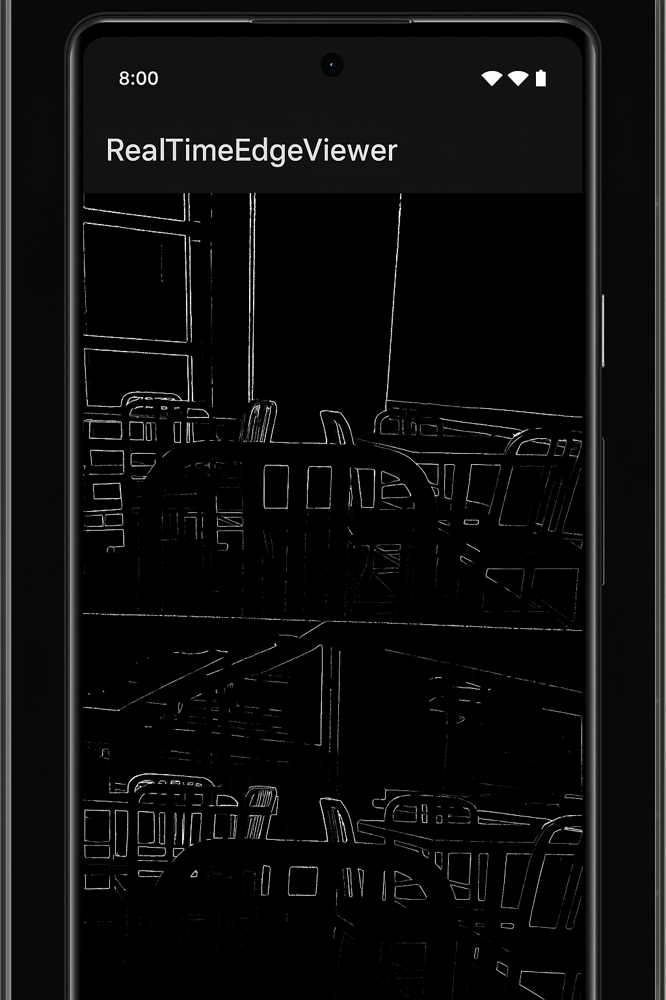
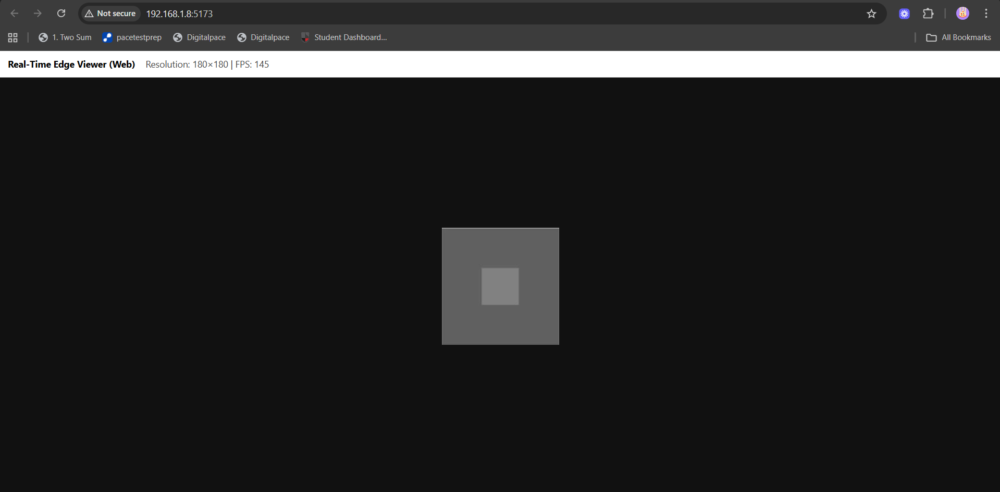

RealTimeEdgeViewer

A real-time Edge Detection Viewer combining Android (Camera2 + OpenCV + OpenGL ES 2.0) and a lightweight **TypeScript Web Viewer**.  
This project demonstrates native–to–GPU data flow, JNI integration, and cross-platform visualization.

 Features

Android (Native)
- Live **camera feed** using Camera2 API (YUV_420_888 format).
- JNI + C++ integration for **real-time edge detection** using **OpenCV**.
- Optimized memory management for zero-copy Y-plane handling.
- **OpenGL ES 2.0 renderer** for smooth GPU display (EdgeRenderer).
- Background threading for non-blocking frame processing.
- Compatible with Android 8.0 (API 26) and above.

 Web (Viewer)
- Lightweight web app built with **TypeScript** + **HTML5 Canvas**.
- FPS overlay and real-time frame simulation.
- Local dev server via `npm run dev`.

Architecture Overview

Android Flow
Camera2 → ImageReader (YUV) → JNI (Y-plane)
→ OpenCV (Canny Edge Detection)
→ RGBA Mat → GLSurfaceView (EdgeRenderer)

Web Flow
Static image or simulated feed → HTML Canvas → FPS overlay

 Prerequisites

| Component | Required Version |
|------------|------------------|
| **Android Studio** | Giraffe / Koala+ |
| **Gradle** | 8.0+ |
| **NDK** | 25+ |
| **OpenCV Android SDK** | 4.5+ |
| **Node.js** | 18+ |
| **TypeScript** | 5+ |

 Setup & Build

Android
1. Open the project in **Android Studio**.  
2. Ensure **NDK**, **CMake**, and **OpenCV SDK** are installed.  
3. Place the OpenCV `.so` libraries in:
app/src/main/jniLibs/arm64-v8a/
app/src/main/jniLibs/armeabi-v7a/

4. Build & Run on a **physical Android device**.  
5. Grant camera permission when prompted.

✅ Expected: Edge-detected camera feed rendered in real-time using GPU.

---

 Web
 Navigate to the web folder:
cd web
npm install
npm run build
npm run dev
Open the link printed in terminal, usually:

http://localhost:8080
Expected: Canvas displaying static/animated edge preview and FPS counter.

Project Structure

RealTimeEdgeViewer/
│
├── app/
│   ├── src/main/java/.../MainActivity.kt
│   ├── src/main/java/.../gl/EdgeRenderer.kt
│   ├── src/main/cpp/native-lib.cpp
│   ├── src/main/jniLibs/ (OpenCV SDK .so files)
│   └── build.gradle.kts
│
├── web/
│   ├── index.html
│   ├── src/main.ts
│   ├── dist/
│   ├── package.json
│   └── tsconfig.json
│
├── docs/ (screenshots, gifs)
├── .gitignore
├── LICENSE
└── README.md

Tech Stack

Layer	Technology
Native Processing	C++ + OpenCV
Android Rendering	OpenGL ES 2.0
UI Thread Handling	GLSurfaceView Renderer
JNI Bridge	Native frame buffers
Web Frontend	TypeScript + HTML5 Canvas
Build Tools	Gradle + CMake + npm

🧪 Commit History 
Step	Commit Summary
Step 1	Project setup & base Android module
Step 2	Manifest, permissions, and layout
Step 3	Camera2 Preview via TextureView
Step 4	JNI + native-lib + CMake integration
Step 5	OpenCV SDK linking & build fix
Step 6	GLSurfaceView rendering + native edge detection
Step 7	Performance optimization & zero-copy
Step 8	Web viewer (TypeScript + Canvas + FPS)
Step 9	Documentation, cleanup & release prep

Troubleshooting
Issue	Solution
UnsatisfiedLinkError	Verify .so files under jniLibs/ and correct ABI
Blank screen	Ensure EdgeRenderer is rendering with valid GL context
Web build fails	Run npm install && npm run build
JNI crash	Check buffer size (RGBA = width × height × 4 bytes)

Working Screenshots

Android App (Real-Time Edge Detection)
This is a sample output from the Android version of **RealTimeEdgeViewer**, showing live edge detection using OpenCV.

Web App (Edge Visualization in Browser)
Below is the web version rendering edges from a static image using WebAssembly,TypeScript.

Deployment
To tag and push the release:
git add .
git commit -m "step 9: repo hygiene – finalized README and release"
git tag -a v1.0 -m "v1.0 RealTimeEdgeViewer"
git push && git push --tags

License
MIT License
Copyright © 2025
Permission is hereby granted, free of charge, to use, copy, modify, and distribute this project with attribution.

Author
Aditya Gupta
Computer Science Engineer(AIML) | Technology Enthusiast
Aditya Gupta
Project focus: applied computer vision and real-time processing.
